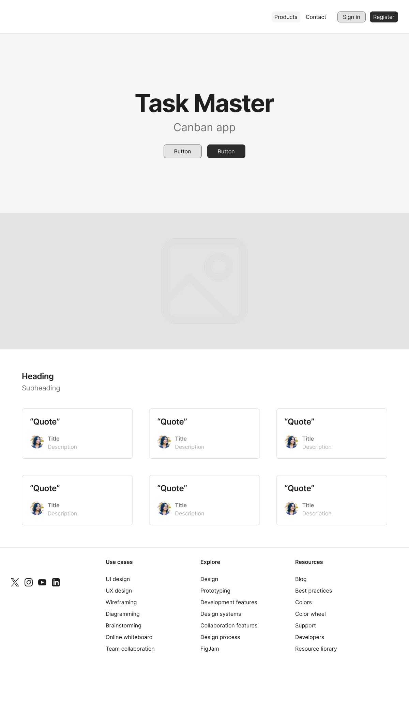

# TaskMaster 🧩

TaskMaster to prosta aplikacja SaaS do zarządzania projektami i zadaniami. Użytkownicy mogą tworzyć projekty, przypisywać zadania, aktualizować statusy i komentować postęp. Projekt oparty jest o nowoczesny stack frontend + backend.

## 🔧 Stack technologiczny

- **Frontend:** Nextjs + shadcn/ui + TypeScript
- **Backend:** Bun + Elysia + Prisma ORM + REST API
- **Baza danych:** PostgreSQL (Docker)
- **Uwierzytelnianie:** JWT + role użytkowników (do dodania)



## 🚀 Uruchomienie

### Wymagania wstępne

- [Docker](https://www.docker.com/) i Docker Compose
- [Bun](https://bun.sh/) (runtime JavaScript)
- Node.js 18+ (dla frontendu, jeśli nie używasz Buna)

### Instalacja i uruchomienie

1. **Uruchom bazę danych PostgreSQL w Dockerze:**

```bash
docker-compose up -d
```

2. **Skonfiguruj backend:**

```bash
cd backend
bun install
cp .env.example .env  # Edytuj .env i uzupełnij zmienne
bun run db:generate
bun run db:push
```

3. **Uruchom backend:**

```bash
bun run dev
```

Backend będzie dostępny na `http://localhost:3001`

4. **Skonfiguruj frontend:**

```bash
cd ../frontend
bun install  # lub npm install
cp .env.example .env  # Edytuj .env i uzupełnij zmienne
```

5. **Uruchom frontend:**

```bash
bun run dev  # lub npm run dev
```

Frontend będzie dostępny na `http://localhost:3000`

### Struktura projektu

```
canban/
├── backend/          # Backend API (Bun + Elysia + Prisma)
│   ├── src/
│   ├── prisma/
│   └── package.json
├── frontend/         # Frontend (NextJS)
│   ├── src/
│   └── package.json
├── docker-compose.yml
└── README.md
```

### Endpointy API

- `GET /` - Strona główna API
- `GET /health` - Health check
- `GET /health/db` - Health check bazy danych

### Uzasadnienie technologii

- **Bun**: Szybki runtime JavaScript z wbudowanym bundlerem, test runnerem i package managerem
- **Elysia**: Nowoczesny, szybki framework dla Bun z TypeScript-first approach
- **Prisma**: Type-safe ORM z automatycznymi migracjami i doskonałym wsparciem dla TypeScript
- **NextJS**: Framework z Reacta, pozwalajacy na łatwy routing i ssg + ssr
- **shadcn/ui**: Komponenty UI oparte na Radix UI z pełną kontrolą nad kodem
- **PostgreSQL**: Zaawansowana relacyjna baza danych z doskonałą wydajnością

#### Kryteria

1. README i uruchomienie – jasny opis projektu, instrukcja startu backendu i frontendu.
2. Architektura / ERD – czytelny diagram ERD z min. 5 tabelami.
3. Baza danych – baza w 3NF, minimum 30 rekordów testowych w bazie.
4. Repozytorium Git – co najmniej 40 commitów, czytelna historia, konwencja commitów.
5. Implementacja funkcji – działa co najmniej 70% zadeklarowanych funkcjonalności.
6. Dobór technologii – backend i frontend na nowoczesnych technologiach, z krótkim
   uzasadnieniem (np. w readme).
7. Architektura kodu – warstwy rozdzielone (kontrolery, serwisy).
8. UX/UI – aplikacja responsywna, poprawny design system.
9. Uwierzytelnianie i autoryzacja – JWT, role użytkowników, poprawna obsługa sesji.
10. API – REST/GraphQL zgodny ze standardami, poprawne statusy i błędy.
11. Frontend–API – frontend faktycznie korzysta z API, poprawna obsługa stanów (loading/error).
12. Jakość kodu – brak powielania logiki, zachowana konwencja nazw, brak śmieci w kodzie.
13. Asynchroniczność / kolejki – przykład zadania kolejkowego (RabbitMQ/Kafka).
14. Dokumentacja API – Swagger/OpenAPI kompletne i aktualne.
